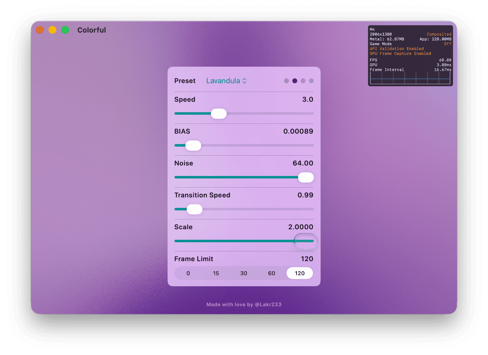

# ColorfulX

ColorfulX is a Metal-backed gradient renderer for Apple platforms. It combines LAB color interpolation, spring-based animation, and a configurable compute pipeline to produce vivid multicolor backgrounds from SwiftUI, UIKit, and AppKit.



## Highlights

- Metal compute shaders render up to eight color stops with LAB interpolation for smooth transitions.
- `AnimatedMulticolorGradientView` drives time-based updates with frame limiting, noise, bias, and transition controls.
- `ColorfulView` exposes the renderer to SwiftUI using familiar bindings, while `MulticolorGradient` covers static gradients.
- Built-in presets (`ColorfulPreset`) and the `ColorfulColors` protocol make it easy to capture repeatable palettes.
- Example app (`Example/ColorfulApp`) showcases live controls for every parameter, including frame limiting and render scaling.

## Requirements

- Swift 5.9 or later (`// swift-tools-version: 5.9` in `Package.swift`).
- iOS 13+, macOS 11+, macCatalyst 13+, tvOS 13+, visionOS 1+ (see `Package.swift`).
- A device or simulator with Metal support.

## Installation (Swift Package Manager)

Add ColorfulX to your package dependencies:

```swift
.package(url: "https://github.com/Lakr233/ColorfulX.git", from: "5.8.0")
```

Add `ColorfulX` to any target that needs the library:

```swift
.target(
    name: "MyApp",
    dependencies: ["ColorfulX"]
)
```

Xcode users can also add the package through **File → Add Packages…** and paste the repository URL.

## Example App

- Open `Example/ColorfulApp.xcodeproj` or the workspace inside `Example/ColorfulApp.xcworkspace`.
- Run the **ColorfulApp** scheme on your preferred device or simulator.
- Use the control panel to tweak preset selection, speed, bias, noise, transition speed, frame limit, and render scale. The chessboard overlay (`ChessboardView`) helps visualise transparency on visionOS/macOS.

## SwiftUI Usage

### Animated Gradient

```swift
import ColorfulX
import SwiftUI

struct AnimatedGradientDemo: View {
    @State private var preset: ColorfulPreset = .aurora
    @State private var speed: Double = 1.0
    @State private var bias: Double = 0.01
    @State private var noise: Double = 8.0
    @State private var transition: Double = 3.5
    @State private var frameLimit: Int = 60
    @State private var renderScale: Double = 1.0

    var body: some View {
        ColorfulView(
            color: $preset,
            speed: $speed,
            bias: $bias,
            noise: $noise,
            transitionSpeed: $transition,
            frameLimit: $frameLimit,
            renderScale: $renderScale
        )
        .ignoresSafeArea()
    }
}
```

`ColorfulView` also accepts bindings to `[Color]`, constant presets (`ColorfulPreset`), or any custom type conforming to `ColorfulColors`. Internally the view converts data to `ColorVector` instances and feeds `AnimatedMulticolorGradientViewRepresentable`.

### Static Gradient

For non-animated backgrounds use `MulticolorGradient` (SwiftUI wrapper for `MulticolorGradientView`):

```swift
import ColorfulX
import SwiftUI
import ColorVector

struct StaticGradientDemo: View {
    private let parameters = MulticolorGradientView.Parameters(
        points: [
            .init(
                color: ColorVector(UIColor.systemPink, usingSpace: .lab),
                position: .init(x: 0.0, y: 0.0)
            ),
            .init(
                color: ColorVector(UIColor.systemBlue, usingSpace: .lab),
                position: .init(x: 1.0, y: 1.0)
            )
        ],
        bias: 0.01,
        power: 4,
        noise: 0
    )

    var body: some View {
        MulticolorGradient(parameters: parameters)
            .ignoresSafeArea()
    }
}
```

The underlying shader supports up to eight color stops (`Uniforms.COLOR_SLOT`). When fewer colors are supplied, the view can repeat stops to fill the pipeline.

## UIKit & AppKit Usage

### Animated Gradients

```swift
import ColorfulX

let animatedView = AnimatedMulticolorGradientView()
animatedView.setColors(ColorfulPreset.aurora)
animatedView.speed = 1.2
animatedView.bias = 0.01
animatedView.noise = 12
animatedView.transitionSpeed = 4.0
animatedView.frameLimit = 60
animatedView.renderScale = 1.0
```

`setColors` accepts `ColorfulPreset`, any `ColorfulColors` value, `[ColorVector]`, or `[ColorElement]` (`UIColor` / `NSColor`). Pass `animated: false` to swap palettes instantly or `repeats: false` to avoid repeating colors when providing fewer than eight stops.

### Static Gradients

```swift
import ColorfulX
import ColorVector

let staticView = MulticolorGradientView()
staticView.parameters = .init(
    points: [
        .init(color: ColorVector(UIColor.systemOrange, usingSpace: .lab), position: .init(x: 0.0, y: 0.0)),
        .init(color: ColorVector(UIColor.systemTeal, usingSpace: .lab), position: .init(x: 1.0, y: 0.5)),
        .init(color: ColorVector(UIColor.systemPurple, usingSpace: .lab), position: .init(x: 0.2, y: 1.0))
    ],
    bias: 0.015,
    power: 4,
    noise: 0
)
```

`MulticolorGradientView` renders immediately when `parameters` change and respects `renderScale` (via `metalLink.scaleFactor`) for performance tuning.

## Presets and Custom Palettes

- Built-in palettes live in `Sources/ColorfulX/ColorfulPreset.swift`. Each case conforms to `ColorfulColors`, exposes a human-readable `hint`, and maps to up to eight LAB colors.
- Create custom palettes by conforming to `ColorfulColors`:

```swift
enum MarketingTheme: ColorfulColors {
    case hero

    var colors: [ColorElement] {
        [
            make(227, 108, 155),
            make(134, 90, 214),
            make(73, 204, 236),
            make(35, 219, 167)
        ]
    }
}
```

- Use the same enum with SwiftUI (`ColorfulView(color: MarketingTheme.hero)`) or UIKit/AppKit (`animatedView.setColors(MarketingTheme.hero)`).

## Parameter Reference & Performance Notes

| Parameter         | Applies To                                   | Description                                                                                                                 |
| ----------------- | -------------------------------------------- | --------------------------------------------------------------------------------------------------------------------------- |
| `speed`           | Animated views                               | Scales how quickly speckles traverse the canvas (`moveDelta` in `AnimatedMulticolorGradientView+Update`).                   |
| `bias`            | Animated & static                            | Controls gradient spread (passed to shader bias). Lower values harden the gradient shape; typical range `0.00001 ... 0.01`. |
| `power`           | Static (`MulticolorGradientView.Parameters`) | Shapes falloff curve; default is `4`.                                                                                       |
| `noise`           | Animated & static                            | Adds procedural noise in the shader; higher values cost more GPU time.                                                      |
| `transitionSpeed` | Animated views                               | Determines how fast colors interpolate when palettes change.                                                                |
| `frameLimit`      | Animated views                               | Caps rendering frequency without altering vsync scheduling. Use 0 for unlimited.                                            |
| `renderScale`     | Animated & static                            | Adjusts Metal drawable scale; lowering improves performance at the cost of resolution.                                      |
| `repeats`         | Animated views                               | Fills unused color slots by repeating colors; disable when the number of stops is stable.                                   |

Tips:

- Use lower `frameLimit` or `renderScale` on battery-constrained devices.
- Keep the number of colors ≤ 8 to avoid truncation.
- Set `speed` to `0` for a frozen animated view, or rely on `MulticolorGradient` for static scenes.

## Troubleshooting

- **No animation appearance** – verify `speed > 0` and that the view remains in a window; `AnimatedMulticolorGradientView` pauses when detached.
- **Palette updates snap instantly** – pass `animated: true` (default) and ensure `transitionSpeed` is greater than zero when calling `setColors`.
- **Visible aliasing** – increase `renderScale` toward `1.0` or higher when using heavy noise.
- **Fewer than expected colors** – ensure `repeats` is `true` or provide at least as many colors as needed (max eight).

## Contributing

Bug reports and pull requests are welcome on GitHub issues. When contributing:

1. Fork the repository and create a feature branch.
2. Update or add SwiftUI/Example demos if behaviour changes.
3. Run the Example app to verify visual regressions.
4. Submit a pull request with a clear summary of the change.

## License

ColorfulX is released under the MIT License. See [LICENSE](LICENSE).
